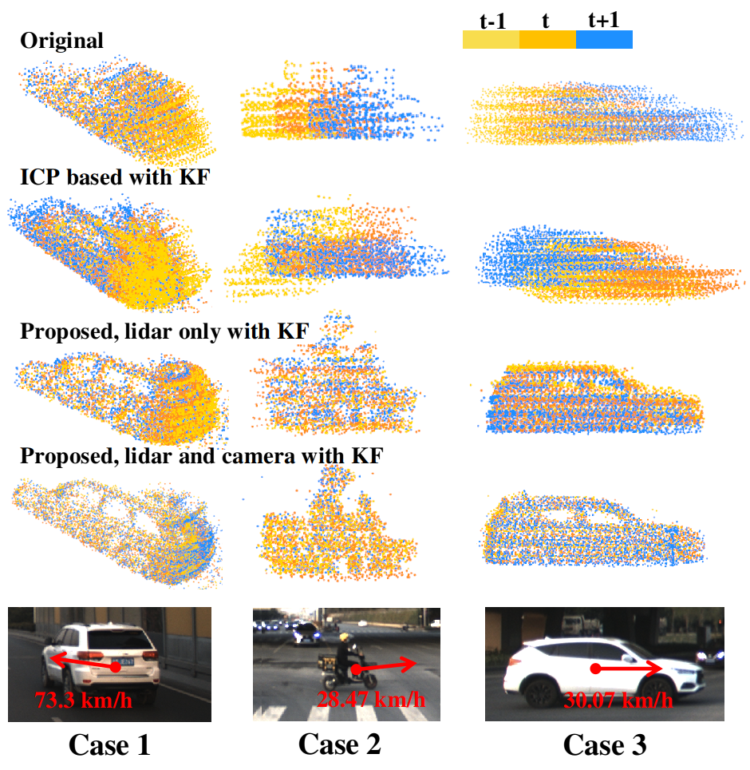

# Lidar with Velocity

####  A robust camera and Lidar fusion based velocity estimator to undistort the pointcloud. 

​	This repository is a barebones implementation for our paper [Lidar with Velocity : Motion Distortion Correction of Point Clouds fromOscillating Scanning Lidars](https://arxiv.org/abs/2111.09497) . It's a fusion based method to handle the oscillating scan Lidar points distortion problem, and can also provide a accurate velocity of the objects. 

​	

​	Here is a Wiki to give a brief intro about the distortion from TOF Lidar and our proposed method. For more infomation, u can also check out the paper [arXiv](https://arxiv.org/abs/2111.09497). 

## 1. Prerequisites

1.1 **Ubuntu** and **ROS**.  Tested on Ubuntu 18.04. ROS Melodic

1.2 **Eigen**

1.3 **Ceres Solver** 

1.4 **Opencv** 

## 2. Build on ROS

Clone the repository and catkin_make:

    cd ~/catkin_ws/src
    git clone https://github.com/ISEE-Technology/lidar-with-velocity
    cd ../
    catkin_make
    source ~/catkin_ws/devel/setup.bash

## 3. Directly run

First download the [dataset](https://drive.google.com/drive/folders/1JEwnVVO84peunFiCXSc-T5QyK0gD3kAt?usp=sharing) and extract in /catkin_ws/ path.

replace the "DATASET_PATH" in config/config.yaml with your extracted dataset path, example: (notice the "/")

    dataset_path: YOUR_CATKIN_WS_PATH/catkin_ws/data/

Then follow the commands blow :

    roscore
    rviz -d src/lidar-with-velocity/rviz_cfg/vis.rviz
    rosrun lidar-with-velocity main_ros

there will be a Rviz window and a PCL Viewer window to show the results, press key "space" in the PCL Viewer window to process the next frame.
